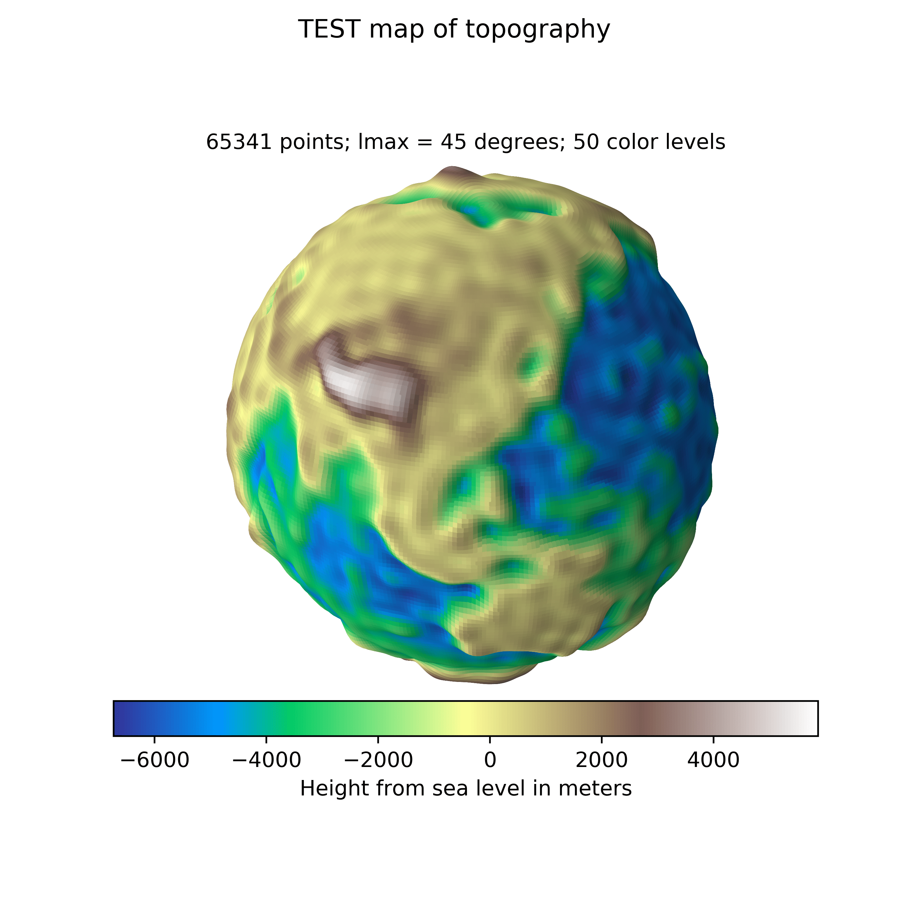
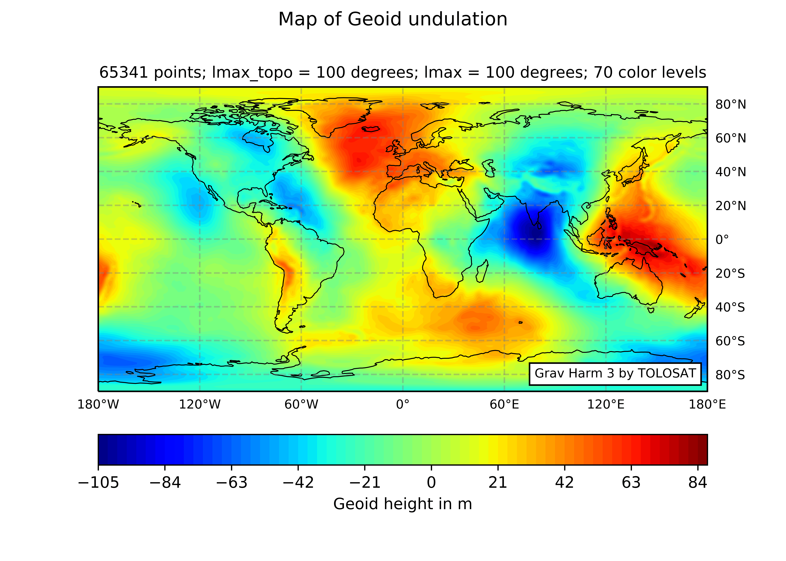

# ==== Grav Harm 3 ====


## About this tool
This tool has been developped to strengthen our claims, here at the TOLOSAT Gravimetry Payload, for phases A and B of this CubeSat mission. I have late-night-baptized this tool:
__"Grav Harm 3"__
For "Gravitational Harmonics 3". 
It is my third attempt at writing this tool from the ground up. 
Any other name ideas are gladly welcome.

This tool was written in _python 3.6_, since 2019, by Xavier C. de Lariolle, [add your names if you've contributed, folks]. 


## What does it do?
The purpose of this tool is to solve for the _Stokes "spherical harmonic coefficients"_ to the geopotential or Earth, sourced from satellite trajectories. 
The calculation process is as follows: 
1. Obtain the positions to the trajectory of a satellite
1. Derivate the position to find the acceleration
1. Solve for the coefficients, by various methods, of the geopotential
1. Calculate the height of the Geoid undulation over the surface of the Earth
1. Compare the calculated model with previous works in scientific litterature
1. Generate specific satellite ephemeris to answer the mission questions, and confirm the mission requirements	

## How to use Grav Harm 3

### Before you start 
I suggest using anaconda to download libraries, and spyder3 as an IDE.

The needed libraries are: numpy, scipy, matplotlib, cartopy, os, time, math, FortranFile [add if you use more]. 

In order to work properly, this tool requires additional directories and files that can be downloaded at:
https://drive.google.com/drive/folders/19jqZdLf2ABAerFzBV8e-6N0IGVGUOotc
The "data" directory contains coefficient files and simulated satellite trajectory files. It must be placed in the master directory. If you cannot access this Google Drive link, you aren't supposed to anyway (for now). If you really want access to it, send an email to any of the contributors.

The simulated satellite ehpemeris have been rendered using NASA's free open source GMAT software.
More on GMAT at: https://software.nasa.gov/software/GSC-17177-1

To download git for Windows, use this guide: https://www.computerhope.com/issues/ch001927.htm


### master directory
In order to handle data, some directories must be created prior to the use of this tool. They are mentionned in the .gitignore to avoid moding loads of images and large text files around. Here is the mimimal structure needed: 
```
> doc
> data  (mentionned in 'Before you start')
	- GeoPot_Coef_cos_deg30.txt
	- GeoPot_Coef_sin_deg30.txt
	- Height_Coef_cos_deg49.txt
	- Height_Coef_sin_deg49.txt
	- Und_min1x1_egm2008_isw=82_WGS84_TideFree_SE    * for the NGA sub-gird functions
> source
> Rendered
	> coefficients
	> grids
	> images
	> temp		
```


### Getting started
This tool contains many scripts, each regrouping the functions related to a specific task. The name of the task is reflected in the name of the script. 

It all happens in the script "GH_user". 
import the ephemeris and coefficient files you desire, 
set the maximum degree wanted for the calculations, 
set the plotting parameters, set the saving parameters.

The user must have some knowledge of python to write scripts, but many basic functions hae aleady been written and can be called from other scripts.


## Geopotential models
This tool's model-mapping capabilities were mainly built around the "EGM2008" Earth Gravity Model, and the "WGS84" earthixed terestrial reference system. 
The data in this model can be found at: https://earth-info.nga.mil/GandG///wgs84/gravitymod/egm2008/egm08_wgs84.html
The original tool was made by  the U.S. National Geospatial-Intelligence Agency (NGA) EGM Development Team. The code and coefficients were designed for Fortran. A quick script to re-write the coefficients into numpy arrays has been written. The fortran source code is being studied to get insight on how it computes geoid undulations.


## Just the Geoid please
This tool calculates the Geoid undulations on it's own, from input coefficients. The tool currently supports computations up to degree 60, degree 154 if I can figure out my math. Going beyond 155 degrees required a new method of computing the Associated Legendre Function. 
The reference ellipsoid is removed fromthe mode, but some residual height (<8m) is left over. 

The NGA (mentioned above) also provides 1'x1' (minute) solution maps in binary format, along with the associated Fortran code to extract sub-grids. Extrapolation is also possible. The sub-grid-extracting code was re-written in python by Xavier C. de Labriolle, with the choice of sample step as a new feature (input the desired minutes between points). This code is in the GH_gridget script. These maps have theoretically been computed up to a degree/order of 2160, but no evidence to suppport that has currently been found. 


## Sources and material
It is important to understand the concepts behing the geopotential, the geoid, the reference ellipsoid, spherical harmonics, Stokes coefficients. 

The main sources for the mathematics involved in this code are:
```
"Definition of Functionals of the Geopotential and Their Calculation from Spherical Harmonic Models"
by Franz Barthelmes
for the ICGEM
Revision: jan. 2013
Will be refered to as "GFZ".

"How to Compute Geoid Undulations (Geoid Height Relative to a Given Reference Ellipsoid) from Spherical Harmonic Coefficients for Satellite Altimetry Applications"
by Martin Losch and Verena Seufer
dates back to 2003
Heavily relies on the textbooks" Heiskanen & Moritz (1967)", and "Torge (1991)".
Will be refered to as "The Geoid Cook Book"
```
 
## Some information for coders and nerds
To calculate geopotential values and to describe satellite trajectories, this python tool uses the spherical coordinates system, and more specifically the ISO convention:
```
r     = radius in km ; [0, inf()]
theta = inclination around the z axis in radians; [0, pi] (Latitude)
phi   = azimuth the z axis in radians; [0, 2*pi] (Longitude)
```
They must be adapted to lat/long coordinates by: 
```
Lat   = (pi/2 - theta) * 180/pi
Long  = (phi - pi) * 180/pi
theta = pi/2 - Lat*pi/180
phi   = Long*pi/180 + pi
```
Their equivalent in the cartesian coordinates is: 
```
x = r * sin(theta) * cos(phi)
y = r * sin(theta) * sin(phi)
z = r * cos(theta)
# This is function: x,y,z = GH_convert.sph2cart(r,theta,phi)
```


# Images from GravHarm 3
This is the section where I show off a bit

## Plot styles
The maps generated with this tool can be in many styles: 
* A 2D color map

* A 2.5D relief map

* A 3D "Ball Earth" that can be turned aroung in a 3D matplotlib figure
 

## Plot content
Many physical values can be calculated: 
* Topography (seen above)
* Geopotential at the surface of the Earth
* Isopotential surfaces
* Geoid undulation 

As previously mentionned, the official EGM2008 geoid undulations can be extracted and plotted. 
The difference with the computed undulation can be calculated.


# Credits 
* Xavier C. de Labriolle
* Antoine Bendimerad
* Cedric Belmant
* Javier Navarro Montilla
* [Add yourselves folks]

